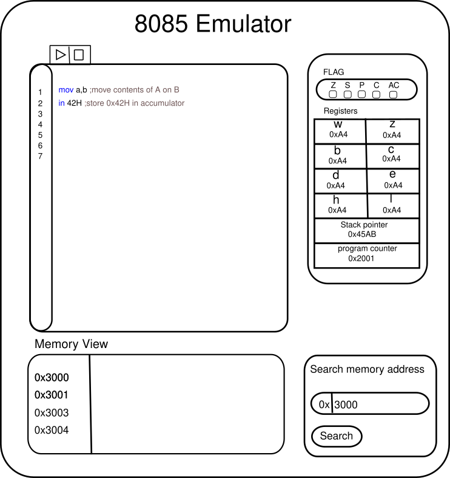

# 8085 Emulator
8085 emulator implements the instruction set provided by the 8085 microprocessor and allows writing , editing , running and debugging assembly programs written for the 8085 instruction set. 
8085 emulator is also intended to be used as learning resource as it will provide documentation and guide for how to write programs on 8085 instruction set. 

## Design Process
The core emulation part will be implemented using Rust. To make sure the implementation works according to how 8085 works, working and programming manual [http://www.nj7p.org/Manuals/PDFs/Intel/9800301C.pdf](http://www.nj7p.org/Manuals/PDFs/Intel/9800301C.pdf) will be used.The implementation will also follow WASM guidelines which makes sure the code can be ported to WASM and produce .wat file. Generated .wat file will then be used in our frontend portion. The UI portion will be implemented using javascript’s state management library called React. 

*Fig. 3.1 Overall design procedure for 8085 emulator*

Frontend/UI portion will have its own code editor that supports syntax highlighting, step by step code running.  a register lookup table for looking what is being stored when the program runs, a memory view table to look at memory contents, output section to see the output of a program, flag section to show what flags are currently enabled. 

*Fig. 3.1 Wireframe for UI portion*
