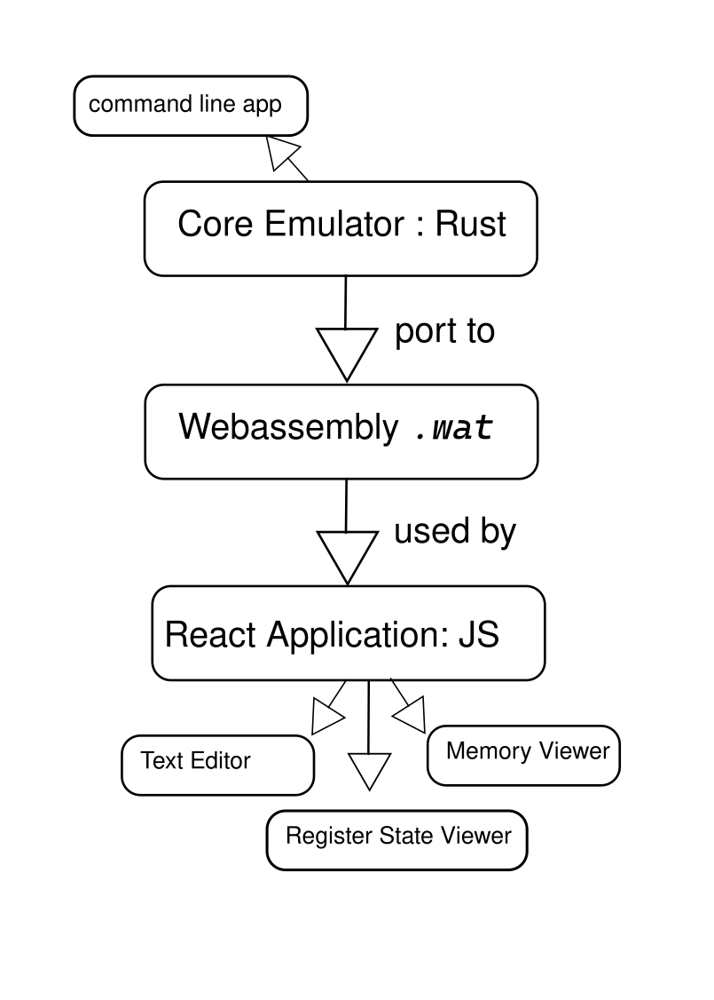
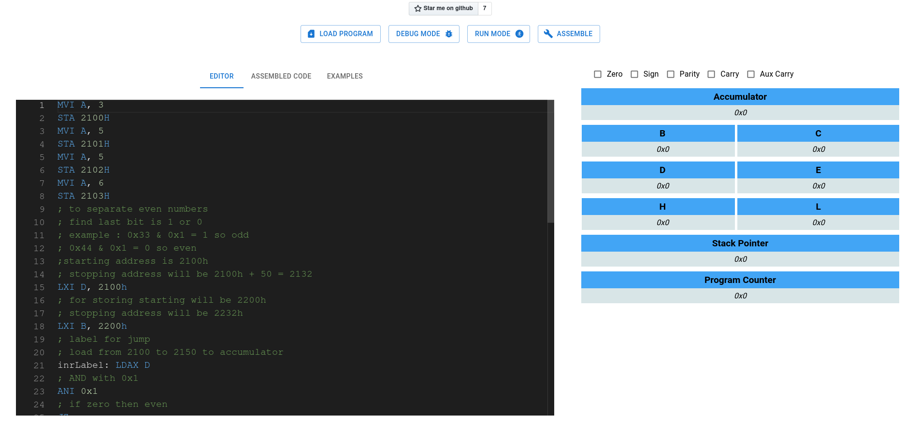

# 8085 Emulator 

### LIVE on [voidash.github.io/8085-Emulator/](voidash.github.io/8085-Emulator/)

8085 emulator implements the instruction set provided by the 8085 microprocessor and allows running assembly programs for that architecture.  

### Purpose
8085 emulator is intended to be used as learning resource as it will provide documentation and guide for how to write programs on 8085 instruction set. 
## Design Process

## CLI App, Assembler,  Emulator and Disassembler
- The core emulation is implemented using Rust using this programming manual [http://www.nj7p.org/Manuals/PDFs/Intel/9800301C.pdf](http://www.nj7p.org/Manuals/PDFs/Intel/9800301C.pdf).  
- The UI portion is implemented using React library for Javascript.



*Overall design procedure for 8085 emulator*

## Building the project 

### Web Application

- clone this project: `https://github.com/voidash/8085-Emulator.git`
- `cd 8085-wasm`
- `./build-wasm.sh`
- `cd ../frontend/`
- `npm install`
- `npm run build`
	
### CLI Application

- clone this project: `https://github.com/voidash/8085-Emulator.git`
- `cargo build --release`


## How to use CLI application

```
$ ./emulator --help
emulator 0.1.0

USAGE:
    emulator [OPTIONS] [FILENAME]

ARGS:
    <FILENAME>    if filename is not passed then the program will run on interpreted mode

OPTIONS:
    -a, --assemble           pass filename and generate assembly code
    -d, --disassemble        pass .asm file and disassemble them
    -e, --emulate            emulate 8085 and write its state and memory values to file
    -h, --help               Print help information
    -i, --interpreted        run on interpreted mode
    -o, --output <OUTPUT>    If output is not provided then the program will assume writing to
                             stdout
    -V, --version            Print version information
```

- `$ emulator --interpreted ` to run on interpreted mode  
```
			  8085 Prompt > mvi a, 45h
				mvi a, 69
				[62, 69]
				8085 Prompt > mvi b, 55h
				mvi b, 85
				[6, 85]
				8085 Prompt > add b
				add b
				[128]
				8085 Prompt > show state
				 

				|-------------|-------------|
				|accumulator: 9a      | 
				|-------------|-------------|
				|b: 55        | c: 0        | 
				|-------------|-------------|
				|d: 0         | e: 0        | 
				|-------------|-------------|
				|h: 0         | l: 0        | 
				|-------------|-------------|
				|stack pointer:  0          | 
				|-------------|-------------|
				|program counter:  5        | 
				|-------------|-------------|
				|s: true,z:false,AC:false,P:true,CY:false| 
				|-------------|-------------| 
```
	
- `$ emulator --assemble filename.asm --output filename.dsm ` to *assemble* the file
- `$ emulator --emualate filename.asm` to *emulate* the assembled file 
- `$ emulator --disassemble filename.dsm` to *disassemble* the assembled file  

## Snapshots


*UI of 8085Emulator*


