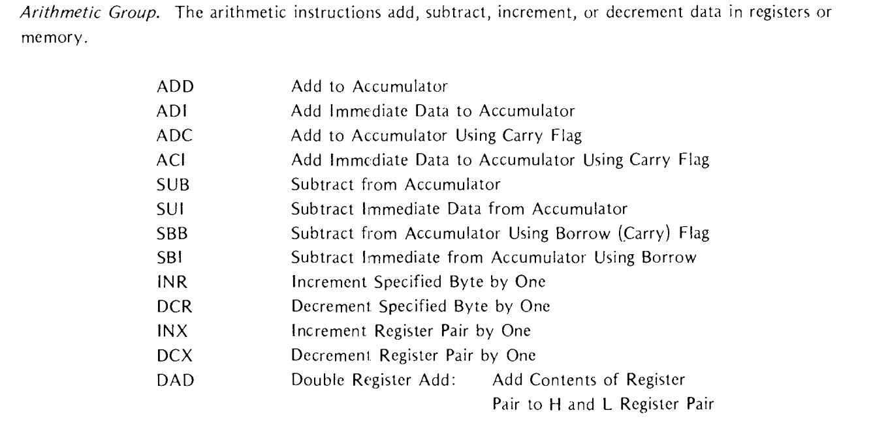

## How assembler works

- object file
		Object file is what is loaded to ROM. 8085 is 40 pinned because  the intellec developement system  only supported 40 pins.

- program listing
		record for source program and object code. Think of it as table 

- cross reference listing
		another record that is one of the diagnostic tools provided by the assembler.  

## 8085 

- memory
- Program counter
- Work registers
- Condition flags
- Stack and stack pointer
- IO ports
- instruction set

### Registers 8085

Internal registers of 8085

#### Condition flags

Carry , sign , zero , parity and Auxillary Carry.

#### Addressing Modes

- *Implied Addressing* : STC, DAA instructions are implied by the instruction function
- *Register Addressing*: CMP E. specify one regiser, another one is by default accumulator so it deals with 8-bit values. Except some like `PCHL` which exchanges the contents of program counter with H and L register.
- *Immediate Addressing*: MVI D, OFFH, LXI SP,30FFH (16bit load). Specify register , then what to load.
- *Direct Addressing*: JMP 1000H  
- *Register Indirect addressing* : references memory by a register pair.  MOV M,C moves the contents of the C register to memory address stored in the H and L pair.

#### Instruction Naming conventions

## Concepts of Assembly Language

- character set
- Delimiters: characters with special meaning to the assembler. Delimiters define the end of source statement, a field or component.

#### Operand field information

#### Two's complement representation of data 

#### Symbolic Addressing
